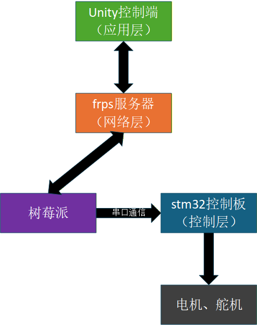
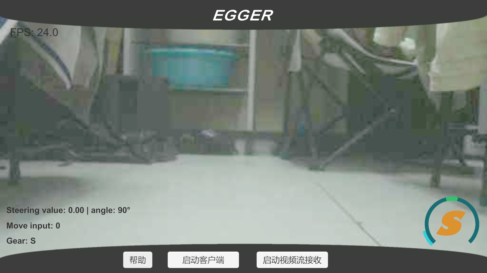

# EGGER Vision

基于Unity上位机 + STM32下位机 + 树莓派视觉模块的远程遥控车项目

## 一、ta是神马东西？

    <a>
        
         
    </a>

视频地址：https://www.bilibili.com/video/BV1trXPBxEZR

&emsp;&emsp;这是一个**完整远程控制小车项目**，包含：

* stm32控制板硬件连接电路
* 车身3d打印结构
* 嵌入式控制程序
* Unity可视化客户端

&emsp;&emsp;实现了：

* 手柄/键盘双模式远程控制
* 实时视频流传输

## 二、ta的组成是？

### 2.1 用了哪些东西

&emsp;&emsp;***硬件部分***：

  1. **stm32f103c8t6最小系统板**: 控制电机、舵机、处理底层控制逻辑
  2. **tb6612电机驱动模块**: 驱动电机
  3. **树莓派4b视觉模块（包括摄像头）**: 采集并发送视频流、接收控制信号
  4. **SG90舵机**: 转向前桥控制、摄像头转向
  5. **lm2596电源模块**: 供电
  6. **12V 18650可充电池组**：供电
  7. **拼夕夕的带有转向前桥的底盘**
  8. **3D打印结构**: 支架、连接件、挂车等

&emsp;&emsp;***软件部分***:

  1. **Unity2022.3.62f2c1**: 远程控制客户端开发
  2. **基于UDP的Unity和树莓派远程通信**: 这部分可以查看我的另一个仓库
     https://github.com/egger435/Unity-Pi-connect
  3. **在EIDE中使用库函数开发的stm32**

### 2.2 小车的架构

    <a>
        
         
    </a>

### 2.3 项目的架构

#### * Board文件夹

&emsp;&emsp;stm32控制板PCB设计文件, 线路就是简单的连连看。初中生来了都能看懂。

#### * Pi文件夹

&emsp;&emsp;树莓派视频流捕获和传输以及接收控制信号的代码

#### * SolidWorksFiles文件夹

&emsp;&emsp;***除了底盘外***的整车的3D结构模型, 包括3D打印件

#### * STM32文件夹

&emsp;&emsp;在EIDE中使用库函数开发的嵌入式控制代码

#### * UnityClient文件夹

&emsp;&emsp;Unity控制客户端工程文件

## 三、ta是怎么工作的

    <a>
        
         
    </a>

&emsp;&emsp;首先，Unity客户端会读取同目录下的`client_config`配置文件，得到服务器IP地址等信息。

&emsp;&emsp;然后，启动客户端的时候就会根据配置文件上的信息初始化。接着等待树莓派程序启动就可以接收视频流了。

&emsp;&emsp;简单来说就是，用户可以在Unity客户端实时看到画面，然后用手柄就能控制小车了。无论用户在哪，只要有网络就行。

&emsp;&emsp;信号流的传递：手柄 → Unity → FRPS服务器 → 树莓派 → stm32控制板

## ta的广告语

* 拖了个挂车，有**更大的储物空间**🚚
* 舵机控制转向加线性电门扳机，带来**更精准的操控**🦽
* 前置摄像头，拥有第一人称的**驾驶乐趣**🏎️
* 远程网络通信，能让你**在地球另一端控制它**🌍
* 还有后视镜，**足不出户**练习停车技巧
* 堪比奥迪夸戳的全史四驱系统:P

## 用户评价

某个不透露姓名的买家：

已购入，不建议入手[发怒]

​速度太慢了，本来买来还想帮我跑校园跑的，结果比我走的还慢，别叫Vision叫蜗牛吧[发怒]

有转向前桥却没有阿克曼转向，也没有差速器，过弯表现一塌糊涂，转弯半径比我奶奶的破三轮都大[发怒]
​

​延迟太不稳定了，一到信号不好的地方帧率就蹭蹭掉[发怒]

​画质太差了，纯纯马赛克
